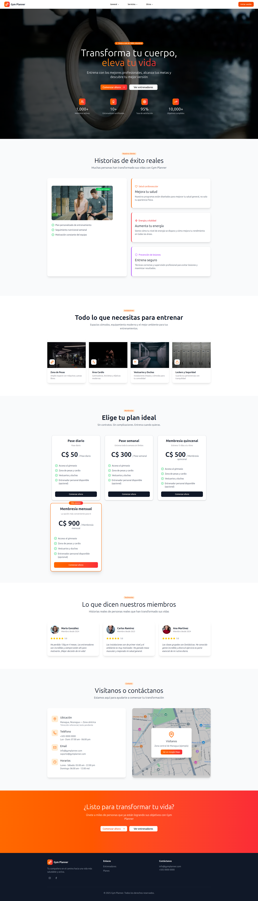
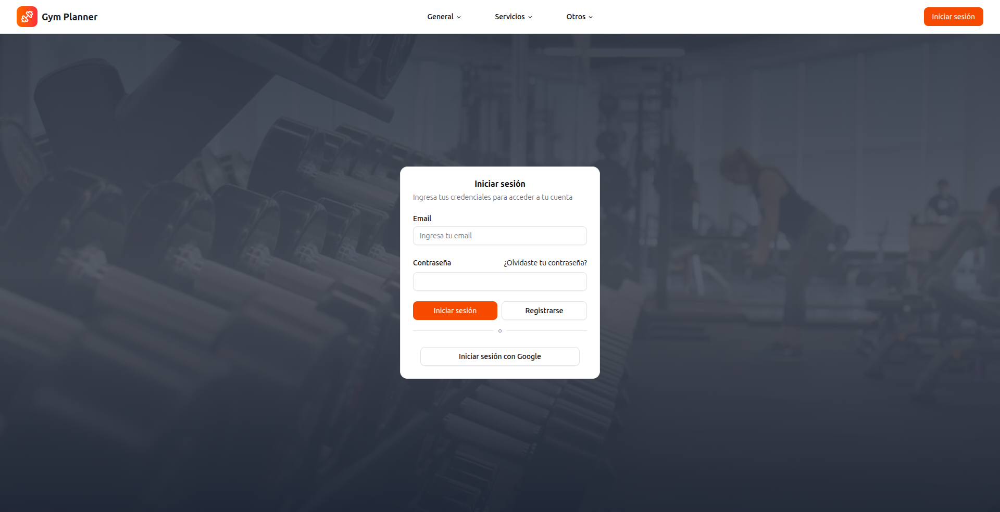
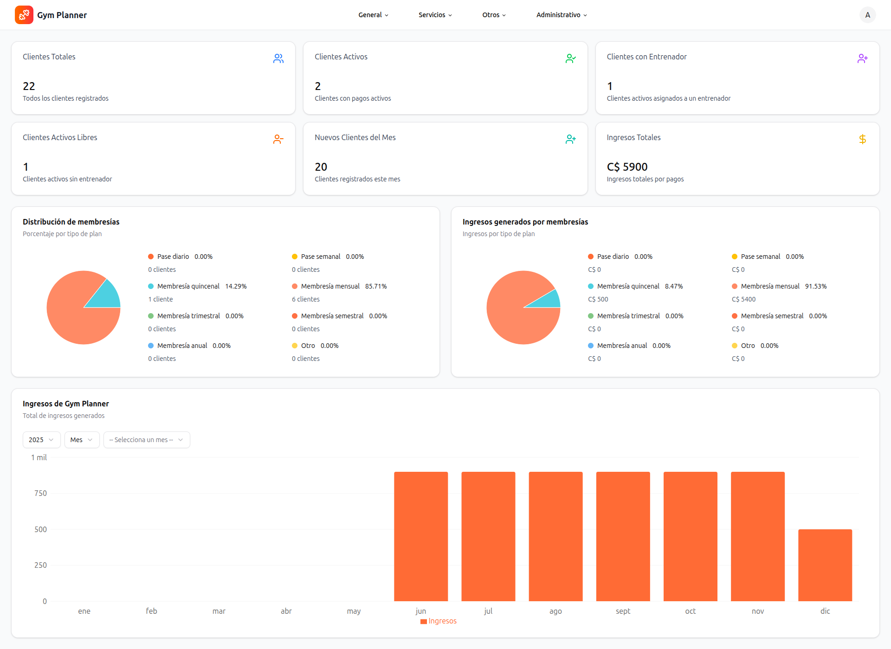
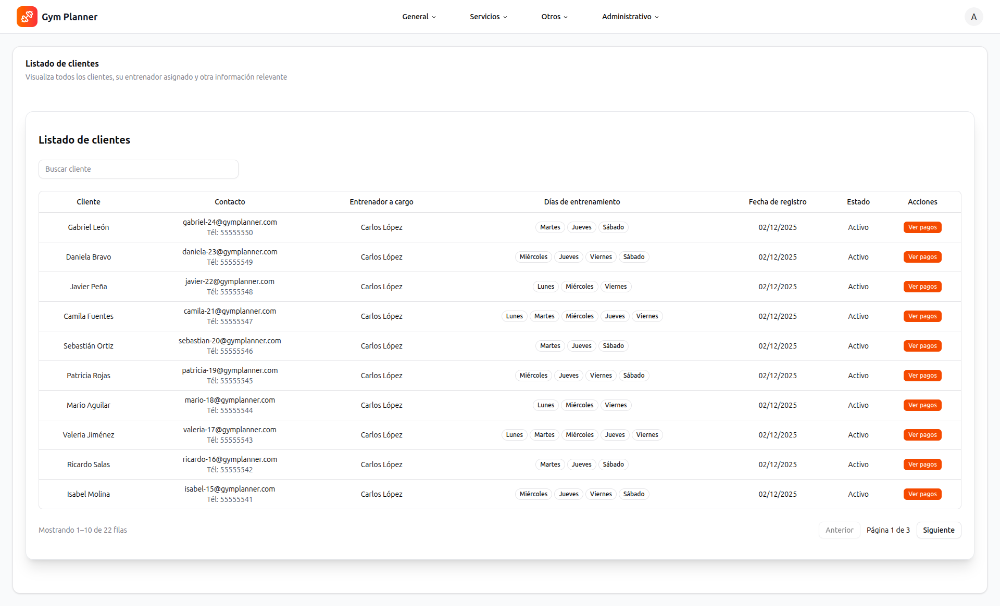
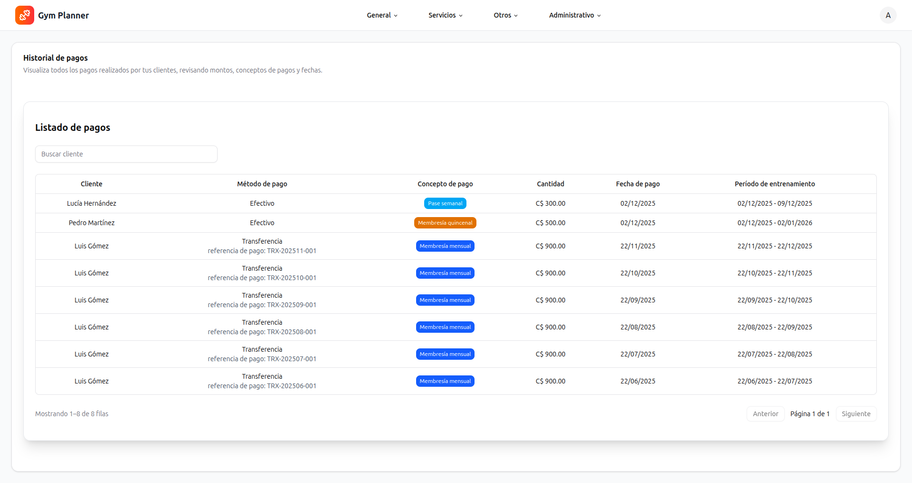
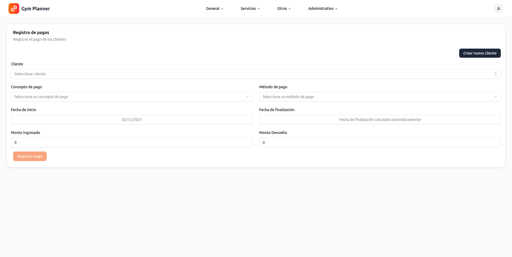
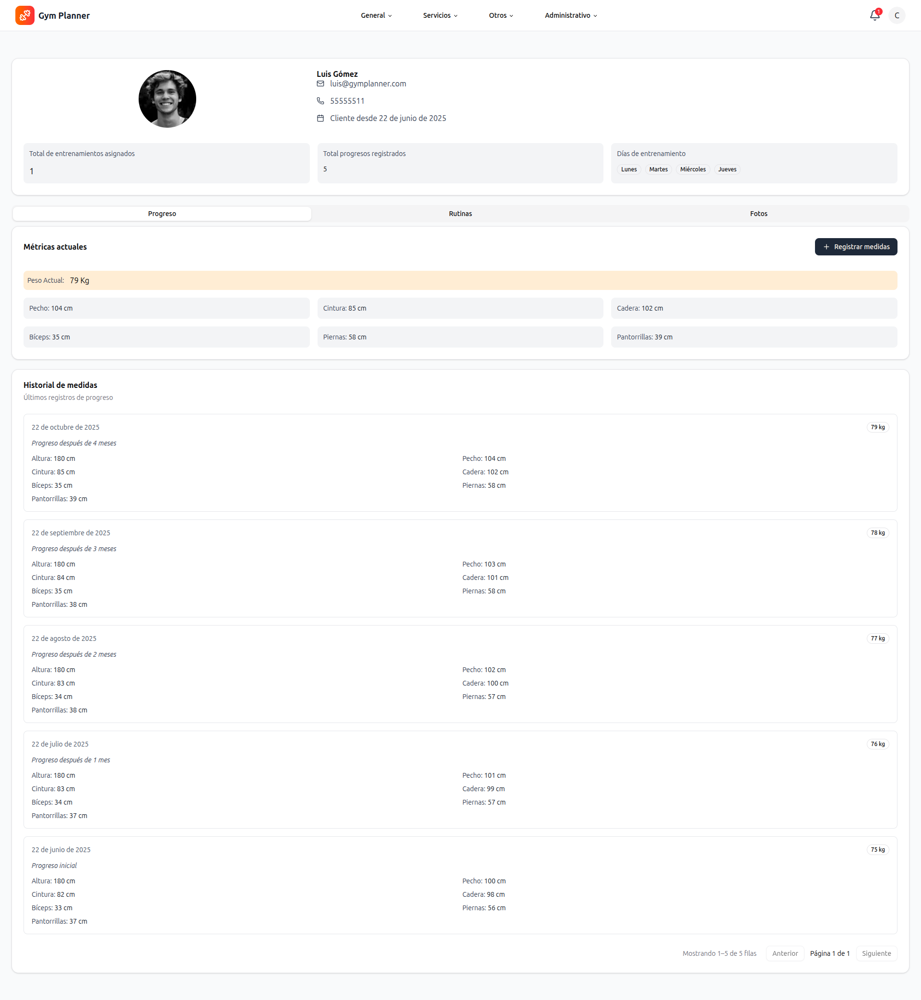
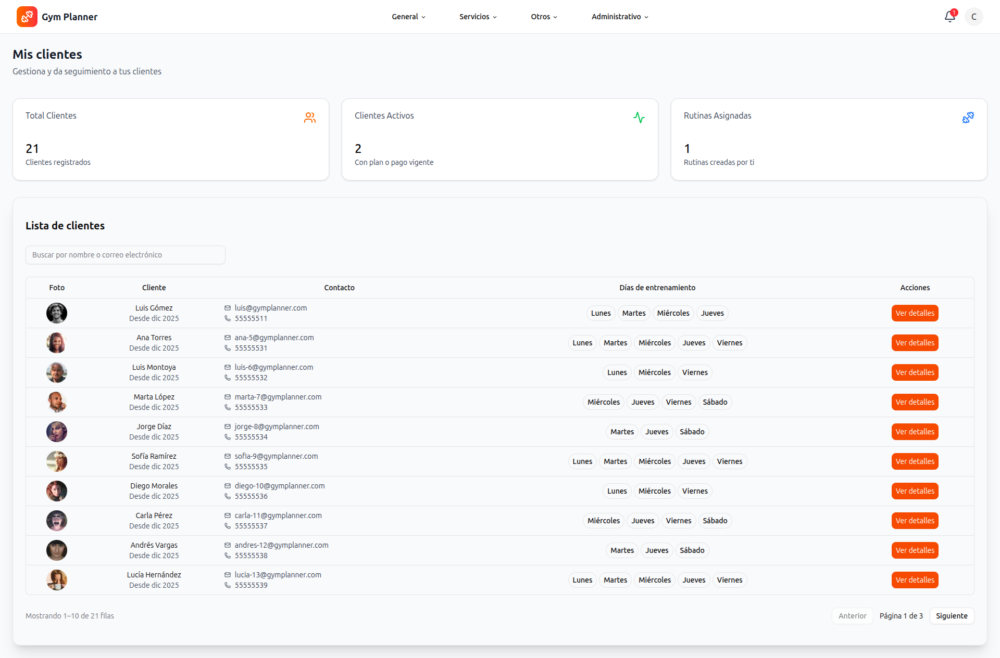
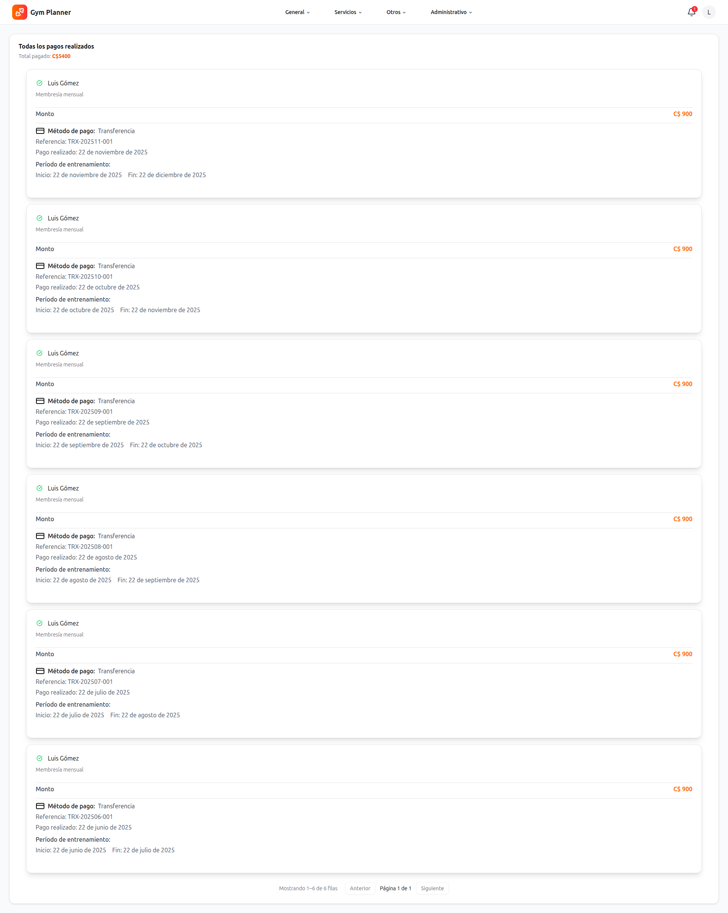
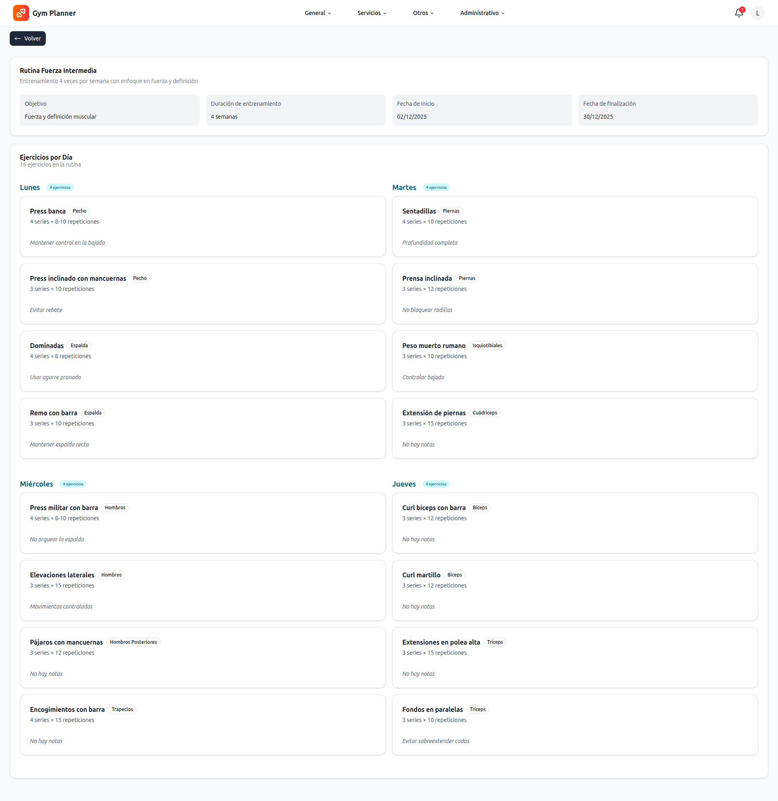

# Gym Planner

Gym Planner is a gym management system designed to handle three main roles: Administrator, Clients, and Trainers.
It allows managing users, payments, routines, training requests, and notifications, all with a modular and scalable architecture.

## ⚠️ Note

Training requests are only for in-house gym trainers. Clients can request training on specific days based on their availability, and the trainer will adjust each client's routine according to the selected days.

---

## About this project

This is a personal project created for learning and practice purposes.

---

## Live Demo

https://gym-planner.vercel.app

## Test Users

| Email                 | Role    | Password |
| --------------------- | ------- | -------- |
| admin@gymplanner.com  | Admin   | Abc123\* |
| carlos@gymplanner.com | Trainer | Abc123\* |
| luis@gymplanner.com   | Client  | Abc123\* |

---

🛠 **Key Technologies**

- **Next.js 16** (App Router)
- **TypeScript**
- **TailwindCSS + Shadcn UI** (reusable and styled components)
- **Zustand** (global state management)
- **Zod** (schema and form validation)
- **TanStack Query** (request handling, caching, and synchronization)
- **Prisma ORM** (database and queries)
- **Cloudinary** (file management and type/format validation)
- **Stripe** (payment processing, for practice purposes only)
- **Sonner** (notifications and alerts)

---

## 📦 Modular Architecture

The project follows a **modular structure** to facilitate scalability and maintainability:

```
gym-planner
├─ app/
│ ├─ (auth) # Authentication, password recovery, and registration
│ ├─ (protected) # Role-based protected routes
│ │ ├─ admin # Management of clients, trainers, payments, and dashboard
│ │ ├─ clients # Management of routines, progress, and payment history
│ │ ├─ notifications # System notifications
│ │ └─ profile # User profile
│ ├─ (public) # Public routes accessible without authentication
│ └─ api/ # Backend endpoints (clients, trainers, payments, stripe, etc.)
├─ features/ # Independent modules with actions, components, and schemas
├─ lib/ # Utilities, helpers, and configuration for Prisma, Stripe, Cloudinary
├─ providers/ # Global providers (AppProvider)
├─ shared/ # Reusable components, hooks, and types
├─ store/ # Global state with Zustand
├─ prisma/ # Migrations and database schema
├─ public/ # Public resources (images, icons)
└─ tsconfig.json

```

## Roles

The system manages three main roles:

**Administrator:** full management of clients, trainers, payments, and dashboard.

**Trainer:** management of their clients, routines, schedules, and feedback.

**Client:** access to their routines, progress history, and training requests on specific days according to the availability of the gym's trainers.

---

## Key Features

- **Administrator Dashboard:** view KPIs, income, and payment history.
- **Client and Trainer Management:** register, edit, and manage clients, trainers, payments, and routines.
- **Training Requests:** clients can request training sessions only on available days with gym-employed trainers. Trainers can then adjust routines based on the selected days.
- **Notifications:** receive alerts for payments, routines, and important events.
- **Stripe Checkout:** securely process payments.  
  ⚠️ Note: For development and testing purposes only; other payment gateways may require additional information.
- **Cloudinary Integration:** manage files such as profile images and PDFs. Supports validation for file types and sizes (jpeg, png, webp, avif, pdf).

---

## ⚙️ Environment Configuration

### Stripe

To enable Stripe functionality, sign in to your Stripe account and add the following variables to your `.env` file:

```
    NEXT_PUBLIC_STRIPE_PUBLISHABLE_KEY=your_publishable_key
    STRIPE_SECRET_KEY=your_stripe_secret
    STRIPE_WEBHOOK_SECRET=your_stripe_webhook_secret
```

### Cloudinary

To enable Cloudinary functionality, sign in to your Cloudinary account and add the following variables to your `.env` file:

```
    CLOUDINARY_NAME=your_cloud_name
    CLOUDINARY_API_KEY=your_api_key
    CLOUDINARY_API_SECRET=your_api_secret
```

---

## 🖼 Screenshots

### Home



### Login



### Admin Dashboard



### Admin Clients



### Payment History (Admin)



### Register Payment (Admin)



### Trainer - Client Details



### Trainer - Clients List



### Client Payment History



### Client Routine



---

## Getting Started

1. Clone this repository:

```
    git clone https://github.com/Antonio-Conrado/gym-planner.git
```

2. Navigate to the project folder:

```
    cd gym-planner
```

3. Create a `.env` file in the root directory by copying the template and updating the values with your own:

```
    cp .env.template .env
```

4. Install the dependencies:

```
    pnpm install
```

5. Start the database using Docker:

```
    docker compose up -d
```

6.  Run Migrations and Seed with Prisma

### Optional Commands

```
    pnpm mg <name_of_migration>  # Run migrations
    pnpm mg-reset                 # Reset migrations if needed
```

### Required Commands

```
    npx prisma generate # Generate Prisma client
```

### Commands to Populate the Database after Generating Prisma Client

```
    pnpm seed # Run seed
```

7. To run the standard development server:

```
     pnpm run dev
```

## 📜 Scripts

| Command          | Description              |
| ---------------- | ------------------------ |
| `pnpm dev`       | Start development server |
| `pnpm build`     | Build the project        |
| `pnpm start`     | Run production server    |
| `pnpm seed`      | Seed database            |
| `pnpm mg <name>` | Run Prisma migrations    |
| `pnpm mg-reset`  | Reset migrations         |
